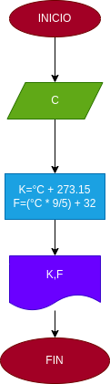

# EJercicio No.1

## Pasar de grados centigrados a grados Fahrenheit y Kelvin

# ANALISIS

Variabes de entrada (input)

C: Grados centigrados

Variables de proceso y salida (precessing, storage, output)

K:Grados Kelvin
F:Grados Fahrenheit

# DISEÑO

# CONSTRUCCION

